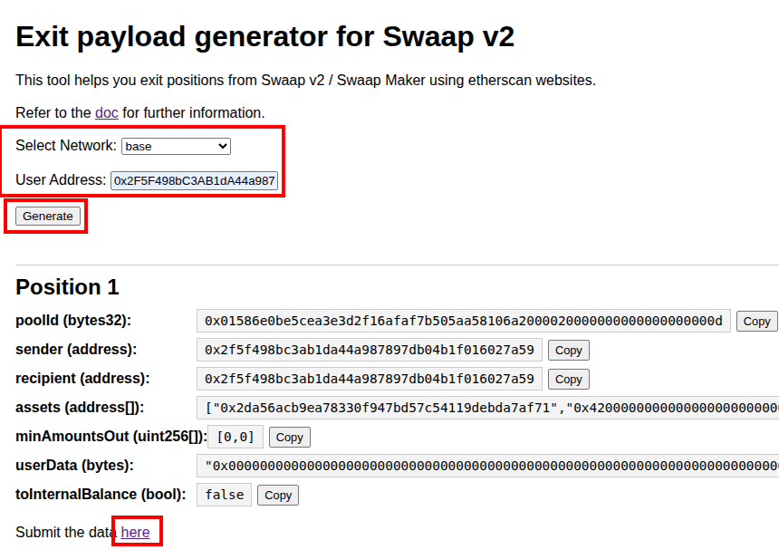
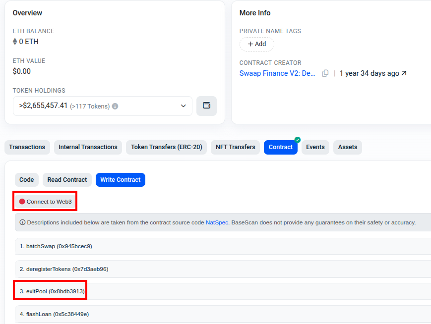
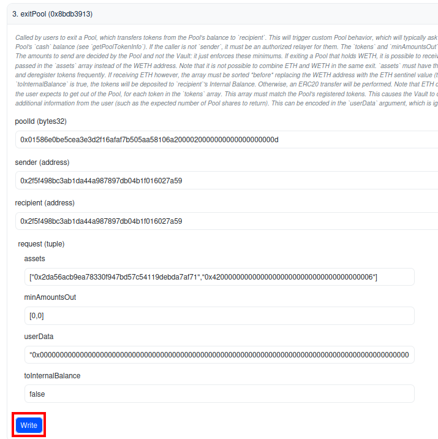

# Swaap v2 exit payload
The following gives an alternative to withdraw all user funds from swaap v2 using the [payload generator](https://swaap-labs.github.io/swaap-v2-exit-payload) and etherscan websites.

## 1- Generate the payload
Fill the network and wallet's address you wish to withdraw from and generate the necessary payloads as shown below.
Once generated click on "here" to continue with the next steps.

## 2- Connect your wallet
Connect your web3 wallet and unroll "exitPool" as shown below.

## 3- Fill the fields and send 
Copy the data generated in the first step and paste them respectively as show below.
Once you're done click on "Write" to send the tx request to your wallet. Confirm it.
Repeat this step if you have more than 1 position on the same network.

Repeat steps 1 -> 3 for each network 